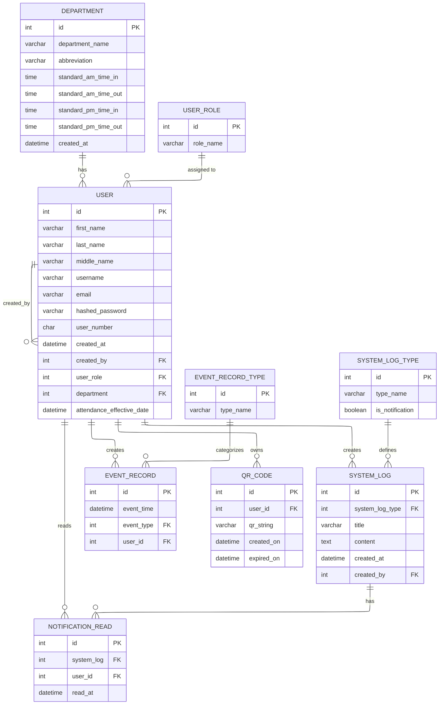
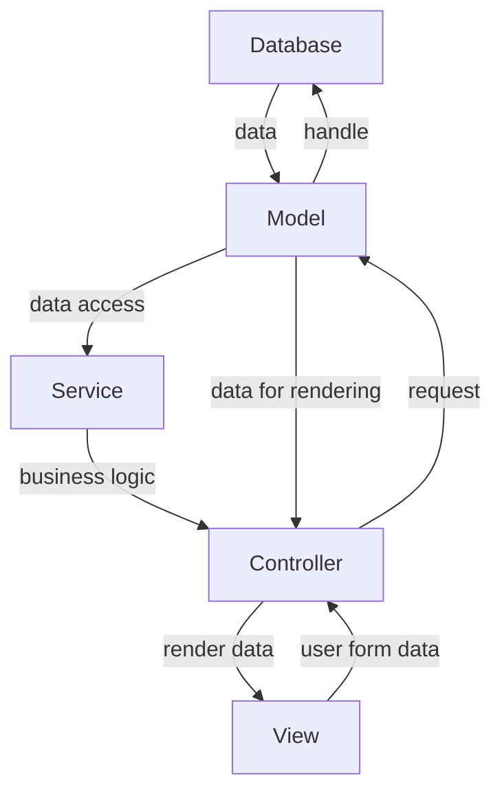

# Daily Time Record

A daily time recording system with CRUD functionality, built on the MVCS design.

## Main Features

- QR code-based time-in/time-out
- Role-based access control
- Attendance metrics
- Responsive dashboard layout
- Dark Mode

## Technical Stuff

- **MVCS** (Models, Views, Controllers, Services) design pattern
- PHP routing and the use of Apache's web server config for SEO-friendly URLs
- Passwords are hashed when stored in the database for security
- Normalized, 3NF-compliant database design

### CRUD Access Overview

| Role     |                 Create                 | Read                              | Update                            | Delete                            |
| -------- | :------------------------------------: | --------------------------------- | --------------------------------- | --------------------------------- |
| Admin    | Register Users (of all roles), Records | Own profile, Any user, Any record | Own profile, Any user, Any record | Own profile, Any user, Any record |
| Manager  |              Own records               | Any user, Any record              | Any user, Any record              | None                              |
| Employee |              Own records               | Any record                        | None                              | None                              |

### Physical Data Model

### MVCS Flow

