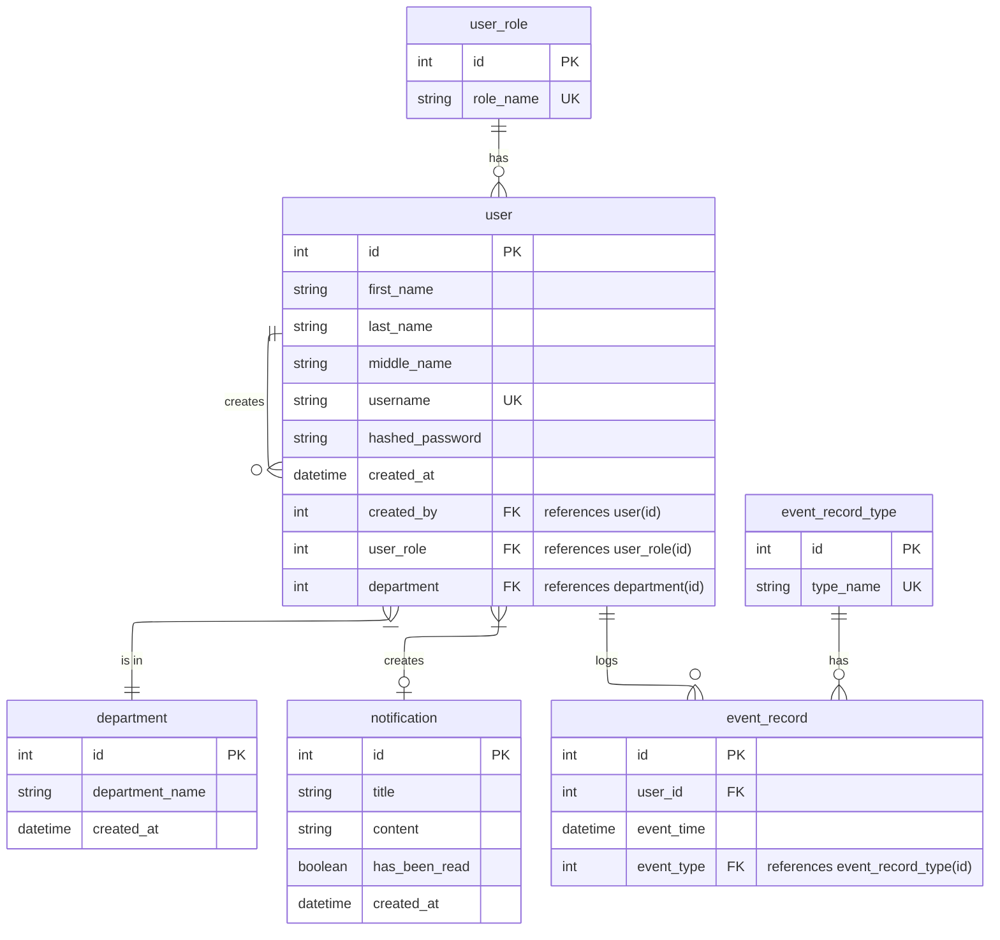
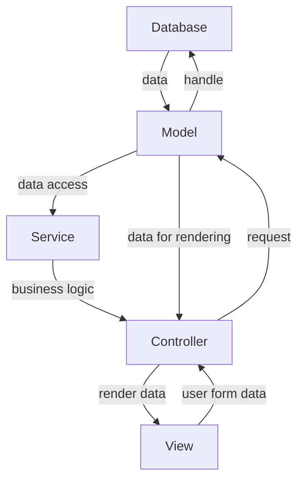

# Daily Time Record
A simple time recording system with CRUD functionality, built on the MVCS design.
## Main Features
- Role-based access control
- Responsive dashboard layout
- Dark Mode with smooth transitioning (TBI)
## Technical Stuff
- MVCS (Models, Views, Controllers, Services) design pattern
- PHP routing and the use of .htaccess for SEO-friendly URLs
- Passwords are hashed when stored in the database for security
- Fully normalized, 5NF-compliant database design
### CRUD Access Overview
| Role     |                 Create                 | Read                              | Update                            | Delete                            |
| -------- | :------------------------------------: | --------------------------------- | --------------------------------- | --------------------------------- |
| Admin    | Register Users (of all roles), Records | Own profile, Any user, Any record | Own profile, Any user, Any record | Own profile, Any user, Any record |
| Manager  |              Own records               | Any user, Any record              | Any user, Any record              | None                              |
| Employee |              Own records               | Any record                        | None                              | None                              |
### Simple Entity-Relationship Diagram

### MVCS Flow
