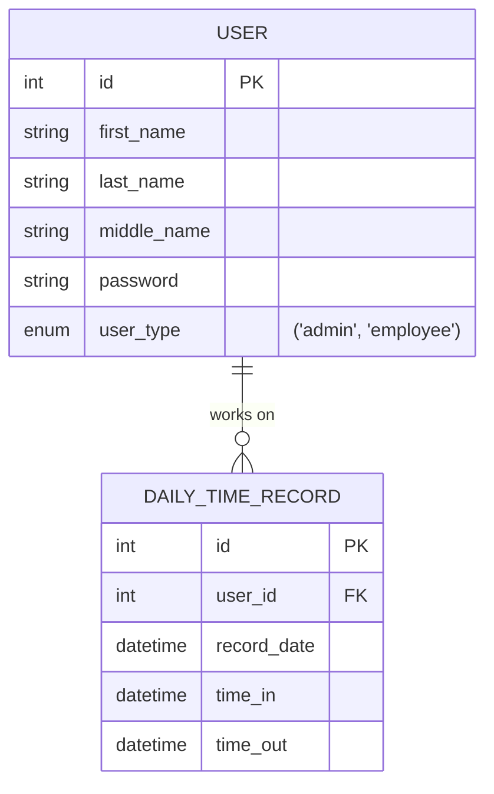

## Daily Time Record

```mermaid
erDiagram
USER{
int id PK
string first_name
string last_name
string middle_name
string password
enum user_type "('admin', 'employee')"
}

DAILY_TIME_RECORD{
int id PK
int user_id FK
datetime record_date
datetime time_in
datetime time_out
}

USER||--o{DAILY_TIME_RECORD:"works on"
```
