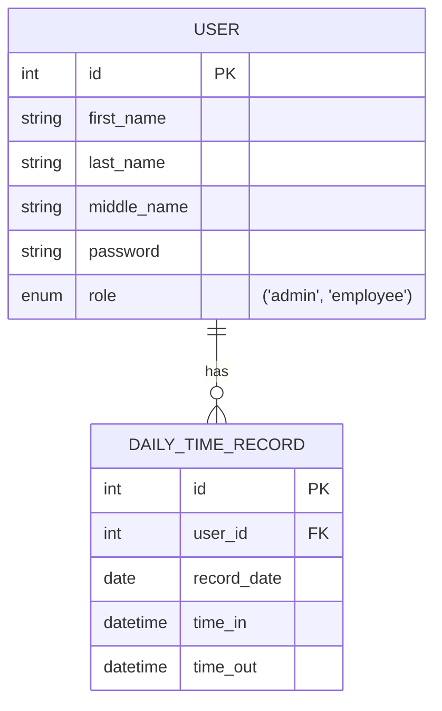

# Daily Time Record
A simple time recording system with CRUD functionality, built on the MVC design.
## Main Features
- Role-based access control
- Responsive dashboard layout
- Dark Mode with smooth transitioning (TBI)
## Technical Stuff
- MVC design pattern
- PHP routing and the use of .htaccess for SEO-friendly URLs
- Passwords are hashed when stored on the database for security
### CRUD Access Overview
| Role     |                 Create                  | Read                              | Update                            | Delete                            |
| -------- | :-------------------------------------: | --------------------------------- | --------------------------------- | --------------------------------- |
| Admin    | Register Users (of all roles), Records  | Own profile, Any user, Any record | Own profile, Any user, Any record | Own profile, Any user, Any record |
| Manager  | Register Users (employees), Own records | Own profile, Any record           | Own profile                       | None                              |
| Employee |           Own records (daily)           | Own profile, Own records          | Own profile                       | None                              |
### Simple Entity-Relationship Diagram
