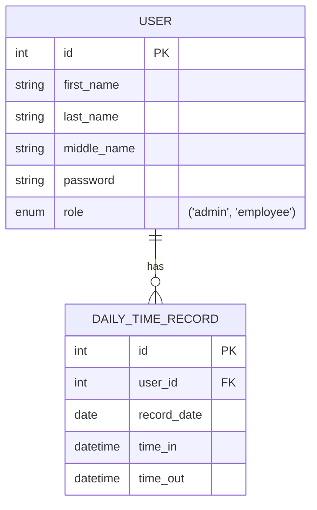

# Daily Time Record
A simple time recording system with CRUD functionality.
## Main Features (TBI)
- Dark Mode with smooth transitioning
- Role-based authentication
- Responsive dashboard layout
## Simple Entity-Relationship Diagram
